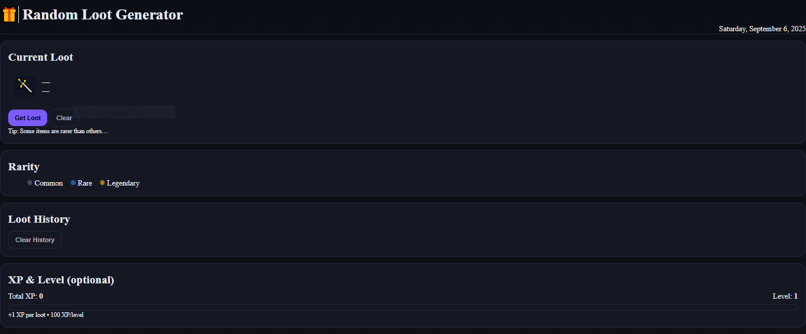

🎁 Random Loot Generator

A fun RPG-inspired mini app that generates random loot with rarity chances (Common, Rare, Legendary). Each loot grants XP, and you can track your loot history while leveling up.

🌐 Live Demo

👉 [https://cdpn.io/pen/debug/EaVdqNj?authentication_hash=YvMgOmyzNbzMe]

✨ Features

Random Loot – click a button to get a random item with rarity chances

Rarity Colors – Common (gray), Rare (blue), Legendary (gold with glow)

Loot History – shows your last 5 loot items

XP & Level System – +1 XP per loot, level up every 100 XP

Local Storage – history and XP saved even after refresh

Clear Options – reset loot display or clear entire history

🖼️ Screenshot

📖 Project Overview

This is Project 24 in my Zero-to-Hero coding journey.
It’s a light-hearted app for practicing JavaScript randomization, arrays, DOM updates, and localStorage, wrapped in an RPG “loot box” theme.

🛠️ Built With

HTML – app structure and elements

CSS – card layout, rarity colors, and styles

JavaScript – loot randomizer, XP system, and localStorage

🚀 How to Run

Clone or download the repo

Open index.html in your browser

Click Get Loot to generate random items

Track loot history and watch your XP grow
